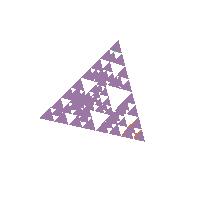

#geo-metry
Custom HTML elements for 3D geometries.



##Usage
In your HTML include the JS:

```html
<script src="https://raw.githubusercontent.com/nickdesaulniers/geo-metry/master/build/3d-tags.min.js"></script>
```

Then, add custom tags!
```html
<geo-metry color="red" width="200" height="200"/>
```

Also, view source of [this](http://nickdesaulniers.github.io/geo-metry/test/);

To see all of the kinds of geometries you can create, see [prims](https://github.com/nickdesaulniers/prims#examples).
